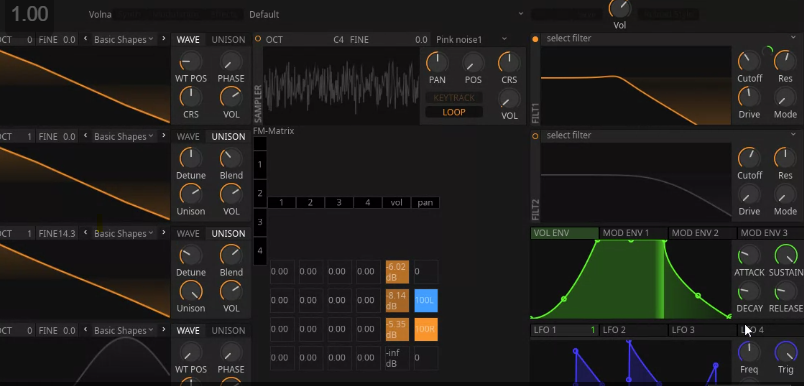

# CLAP plugin in rust

It's still WIP, run the below command to compile it

```
cargo xtask bundle osc3-mcp-rust
```

Working in fl studio v25.1.1

Todo:
- Migrate to vizia - DONE
- Finish pending tasks:
- Add phase offset / detune - DONE
- Add an adsr
- Add a noise option
- Custom waves (Using bezier?)
- Reverb option Frequency gain, phase, detune
- add wt position
- inspiration: 

- Multiple wavetable oscillators (2–3 minimum)
-  WaveTable Position, Phase, Coarse/Fine tuning, Volume
-  Unison: Detune, Blend, Spread, Phase Randomization
