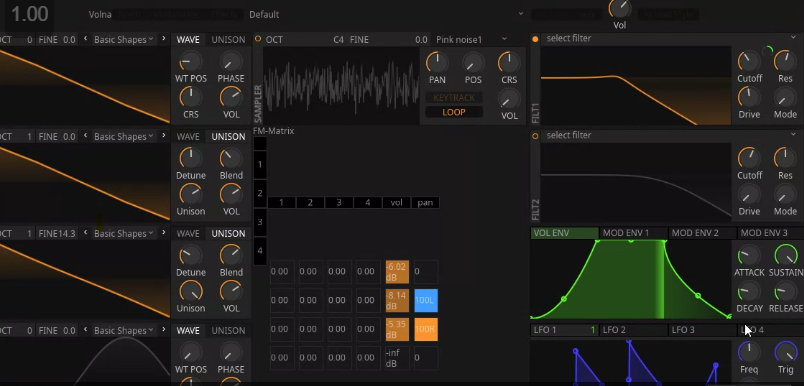

# CLAP plugin in rust

It's still WIP, run the below command to compile it

```
cargo xtask bundle osc3-mcp-rust
```

Working in fl studio v25.1.1

## AI assist configuration

The "AI ASSIST" tab talks to Google's Gemini API. Settings (API key, model,
temperature) are stored **outside** the host project, in a per-user config file:

| OS      | Path                                                      |
|---------|-----------------------------------------------------------|
| Windows | `%APPDATA%\TripleOscSynth\config.json`                    |
| macOS   | `~/Library/Application Support/TripleOscSynth/config.json`|
| Linux   | `~/.config/TripleOscSynth/config.json`                    |

The app **auto-generates this file with defaults on first launch** if it's
missing, so you can edit it directly instead of using the in-plugin ⚙ settings
(handy when running inside a host that doesn't forward clipboard paste). A
template is committed as [`config.example.json`](config.example.json) — copy it
to the path above and fill in your key. Format:

```json
{
  "api_key": "PASTE_YOUR_GEMINI_KEY_HERE",
  "model": "Gemini25Flash",
  "temperature": 0.7
}
```

- Get a free key from [Google AI Studio](https://aistudio.google.com/apikey).
- `model` must be one of: `Gemini25Flash`, `Gemini25Pro`, `Gemini20Flash`.
  **Use `Gemini25Flash`** — free-tier availability of the others varies by
  account/region, and an unavailable model returns HTTP 429 (`limit: 0`).
- Never commit a real key. Treat the file as a secret.

Todo:

- Migrate to vizia - DONE
- Finish pending tasks:
- Add phase offset / detune - DONE
- Add an adsr
- Add a noise option
- Custom waves (Using bezier?)
- Reverb option Frequency gain, phase, detune
- add wt position
- inspiration:
  
- Multiple wavetable oscillators (2–3 minimum)
- WaveTable Position, Phase, Coarse/Fine tuning, Volume
- Unison: Detune, Blend, Spread, Phase Randomization
